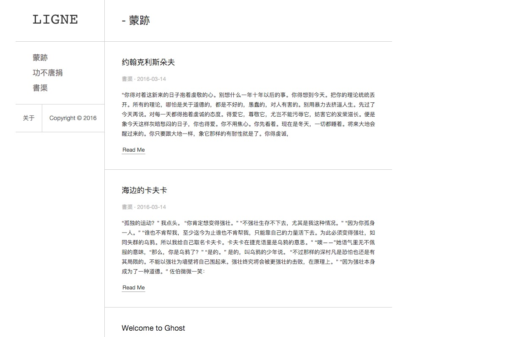
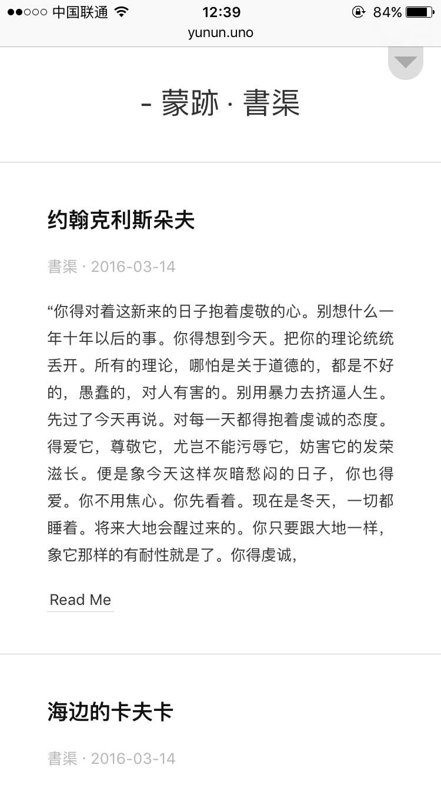

# Ligne

A simple theme for [Ghost](http://github.com/tryghost/ghost/). Support mobile browsers.

Design by [个篱](https://www.zhihu.com/people/geli)

**DEMO** [http://yunun.uno/](http://yunun.uno/)

PC browsers



mobild browsers



## Recommend

Recommend the use of 210px * 100px pictures as logo, if the logo need to show hover effect, image size should be 210px * 220px.

## Development

If you want to develop or make changes to the theme, you will need to have the nodejs. If you are running a Ghost environment locally then you should already have these installed as those are required to run Ghost.

Run the following commands from a terminal:

```
npm install
```

This commands will install gulp and another dependence.


Watch change:

```
gulp watch
```

Build assets:

```
gulp build
```

## The MIT License
